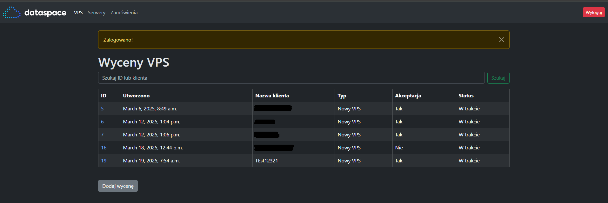
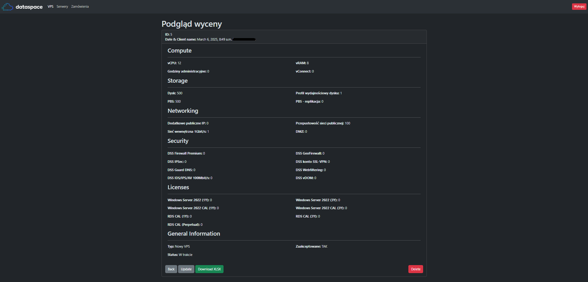

# WIZ - Panel
## Introduction
A web application written in Python Django that is used for pricing virtual machines on a CLOUD platform. It supports MySQL version 5.x and above. The application is run as a Docker container, and the container image is also available in the repository. \
Due to confidentiality, the XML template has been sanitized of all data.

## POV:

